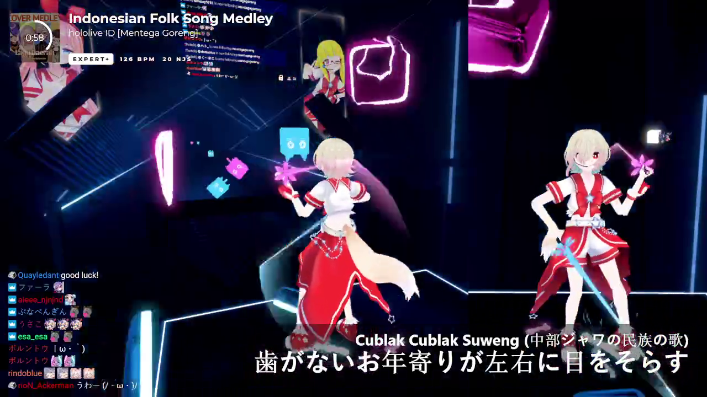

# Mentega Subtitle Overlay for HTTPStatus
The purpose of this overlay is to show subtitle (SRT) when a specific song is played.
(The top part is hardcoded, not part of this overlay)


## How to use
Obviously, install [HTTPStatus](https://github.com/opl-/beatsaber-http-status/releases).

Afterwards, add this URL to your Browser Source in OBS:
```
https://mentegago.github.io/subtitle-overlay-httpstatus/?url={subtitle_url}&name={part_of_song_name}&initialdelay={initial_delay}
```
Replace:
1. `{subtitle_url}` with URL of the subtitle. Make sure cross origin is allowed (such as use GitHub Gist).
2. `{part_of_song_name}` with the name of the song. It doesn't need to be full name, just partial. Also, it's case **in**sensitive. Leave it empty if you want the subtitle to run on all songs.
3. `{initial_delay}` with the amount of ms delay between `songStart` event to the subtitle actually runs. Leave it empty if you don't want any delay.

## Not yet implemented
1. No option to change Websocket URL from default.
2. Pause handling (currently, subtitle will keep on running and will desync).
3. Can only use only song name, no hash ID, etc.
4. The overlay ignores 'end time' of the subtitle.
5. Multiple subtitles for multiple songs. (Probably need to implement some sort of JSON format)

## Building
The code runs on vanilla JavaScript, so no building required! Just clone and run on the latest browser! (It uses modern JavaScript syntax so it won't work on outdated browsers). Go ahead and make a Pull Request if you're interested in helping developing this.

## Dependencies
This software uses:
- [srt-parser-2](https://github.com/1c7/srt-parser-2)

## License
[MIT License](LICENSE)